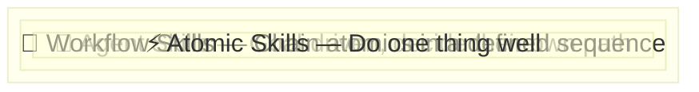
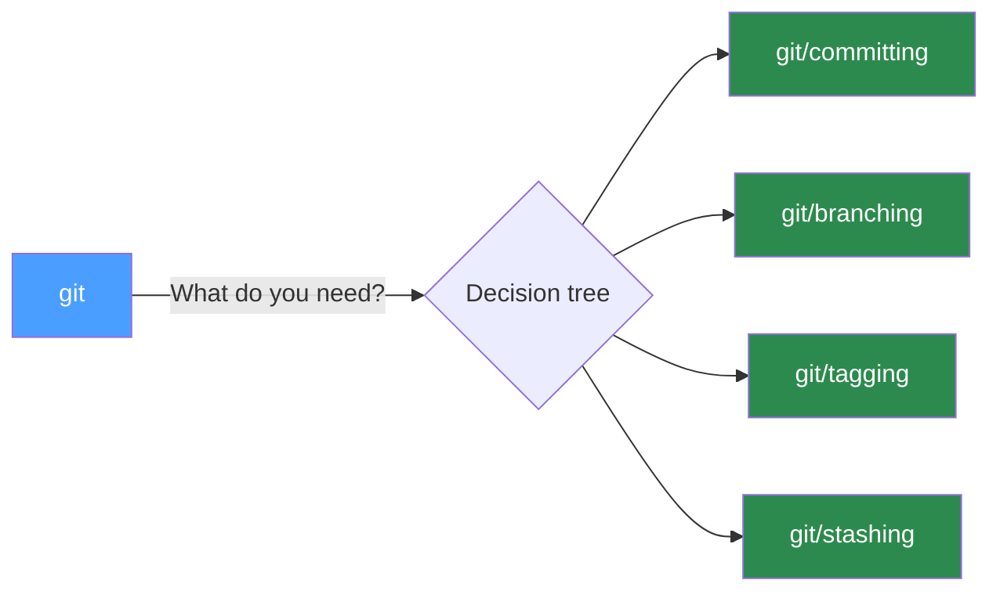
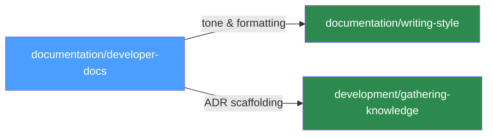
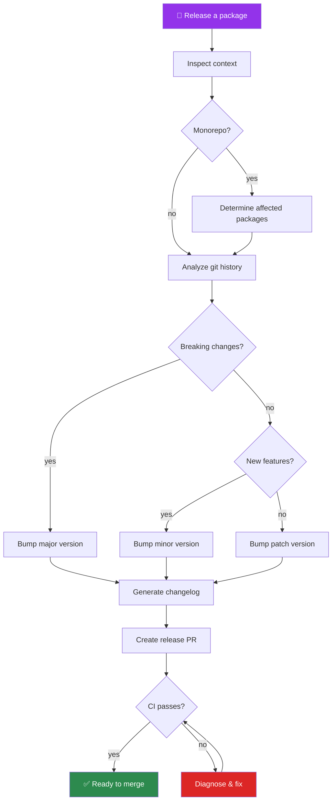
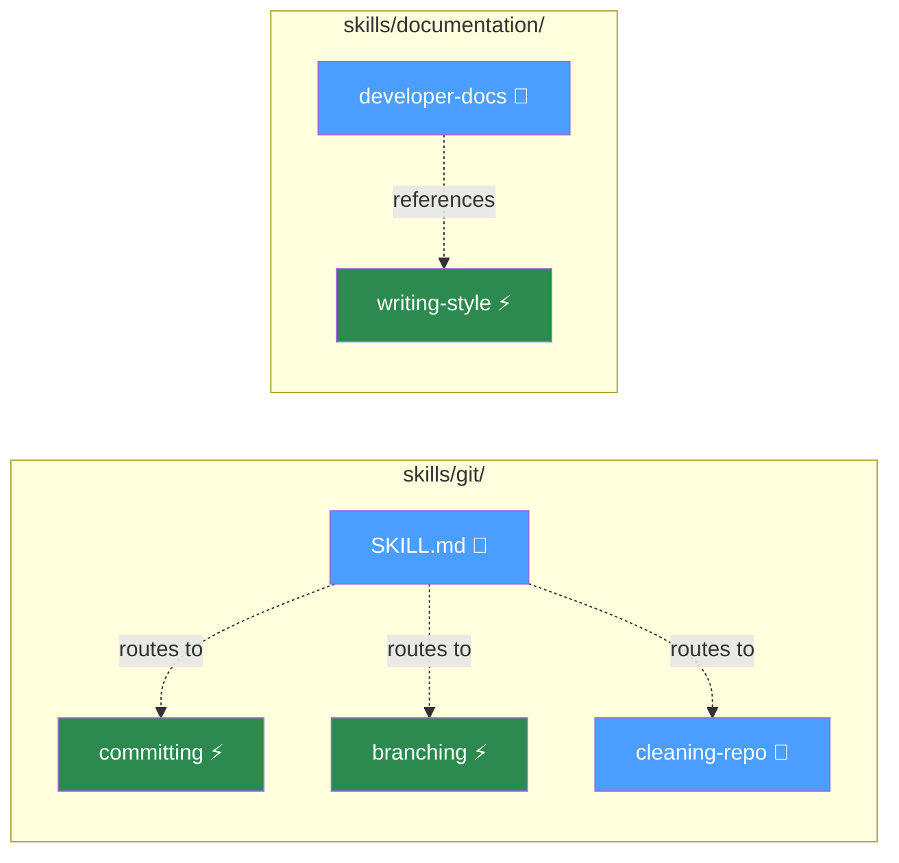
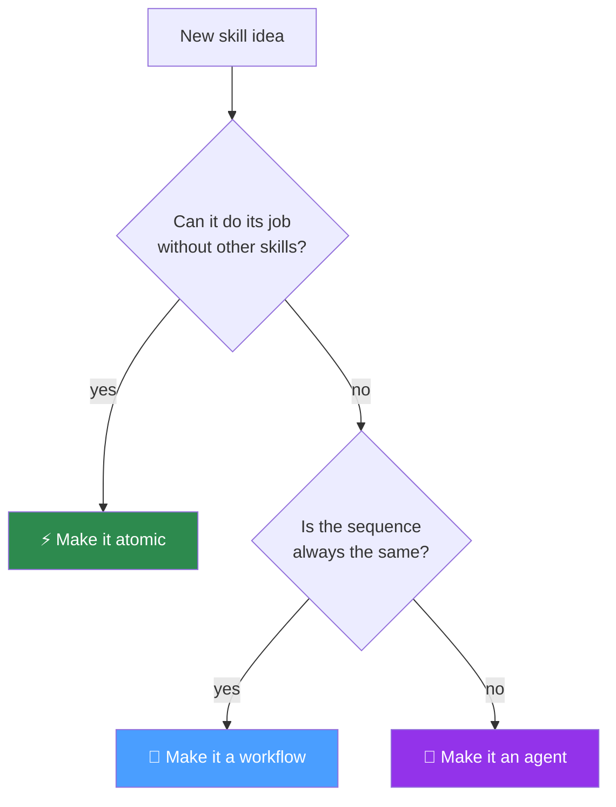

# Skill Taxonomy

Skills are organized into three tiers based on scope and autonomy: **atomic**, **workflow**, and **agent**. Each tier builds on the ones below it.

## The Three Tiers

### Atomic Skills

Small, focused, self-contained. Each one handles a single well-defined task. An atomic skill should be usable on its own without requiring other skills.

**Characteristics:**

- Single responsibility — does one thing
- No dependencies on other skills
- Deterministic — same input produces same kind of output
- Usually maps to one tool or one decision tree

**Examples from this repo:**

| Skill | What it does |
|---|---|
| `git/committing` | Writes a conventional commit message |
| `git/branching` | Creates and manages branches |
| `git/tagging` | Creates semver tags |
| `documentation/writing-style` | Applies voice, tone, and formatting standards |
| `security/auditing-security` | Runs a security review |
| `development/testing` | Authors tests for a given piece of code |

**When to use atomic:** The task is narrow, well-defined, and doesn't require coordinating multiple steps. "Write a commit message", "create a branch", "add tests for this function".

---

### Workflow Skills

Combine atomic skills into a prescribed sequence. A workflow skill knows the steps and their order — it's a recipe. The path through the workflow may branch based on context, but the set of possible paths is predefined.

**Characteristics:**

- Prescriptive — follows a defined sequence of steps
- References or composes atomic skills
- Handles the glue between steps (passing output from one atomic to the next)
- May have branching paths, but the branches are known upfront

**Examples from this repo:**

| Skill | What it composes |
|---|---|
| `git` (parent) | Routes to `branching` → `committing` → `tagging` → `managing-remote` and other atomic git skills in sequence |
| `documentation/developer-docs` | Uses `writing-style` for tone, `gathering-knowledge` for ADRs, then writes the actual doc |
| `documentation/reporting` | Picks report type → applies `writing-style` → follows report-specific template |
| `git/cleaning-repo` | Analyzes dirty state → splits hunks → creates atomic commits → cleans branches → pushes |
| `development/planning` | Breaks down a feature → creates ordered tasks → maps dependencies |

**Composition patterns:**

Workflows reference atomic skills in two ways:

1. **Decision tree routing** — the parent skill's decision tree sends the user to the right atomic skill:

2. **Cross-skill references** — a skill points to another skill for a specific concern:

**When to use workflow:** The task has a known sequence of steps that are always (or almost always) the same. "Ship a PR", "clean up this repo", "write architecture docs".

---

### Agent Skills

Goal-driven rather than step-driven. An agent skill receives an outcome to achieve and decides which workflows and atomic skills to invoke based on what it discovers along the way. The path isn't prescribed — it's determined at runtime.

**Characteristics:**

- Adaptive — inspects context and decides the approach
- May invoke different workflows depending on what it finds
- Handles ambiguity — doesn't need the user to pre-decide the path
- Can loop, retry, or change strategy when something fails
- Uses `Agent` in `allowed-tools` to delegate subtasks

**Example — "Release a package" as an agent skill:**

**Key difference from workflows:** A workflow for "release a package" would have fixed steps. An agent skill for the same goal first checks: is this a monorepo or single package? Are there breaking changes? Is there a changelog already? Does CI pass? — and adjusts its approach based on the answers.

**More examples (conceptual):**

| Skill | How it decides |
|---|---|
| Full repo health check | Runs security audit → checks test coverage → lints → finds dead code → prioritizes findings → creates fix PRs for critical issues |
| Migrate a dependency | Researches new API → finds all usage sites → plans migration order → applies changes file by file → runs tests after each change → rolls back on failure |
| Onboard to a codebase | Analyzes architecture → maps data flow → identifies conventions → generates orientation doc → suggests first tasks |

**When to use agent:** The task has a clear goal but the path depends on what you find. The skill needs to make judgment calls, not just follow steps.

---

## Comparison

| | Atomic | Workflow | Agent |
|---|---|---|---|
| **Scope** | One task | A sequence of tasks | An outcome |
| **Path** | Fixed | Branching but predefined | Determined at runtime |
| **Decision-making** | None — executes | Chooses which branch | Chooses which skills, in what order |
| **Composition** | Standalone | References atomics | References workflows and atomics |
| **Failure handling** | Reports error | May skip or retry a step | Changes strategy |
| **Example prompt** | "Write a commit message" | "Clean up this repo" | "Release v2.0" |

## How Tiers Relate to the Folder Structure

The tier is about behavior, not location. A skill's folder path reflects its **domain** (git, development, documentation), not its tier. Two skills in the same folder can be different tiers:

> ⚡ = atomic, 🔗 = workflow. The tier is evident from the skill's behavior and `allowed-tools`. Agent-tier skills typically include `Agent` in their allowed tools so they can delegate subtasks.

## Guidelines for Choosing a Tier

When creating a new skill, pick the lowest tier that covers the use case:

**Promote up** when you find users chaining the same atomics manually (→ workflow) or when the sequence itself is variable and requires judgment calls (→ agent).

Avoid making everything an agent skill. Most tasks are well-served by atomics and workflows. Agent skills add complexity and are harder to predict and debug. Use them when the adaptability is genuinely needed.
