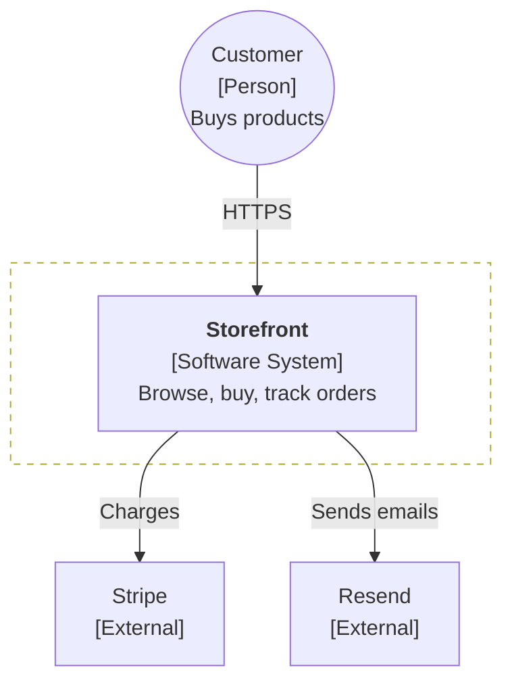
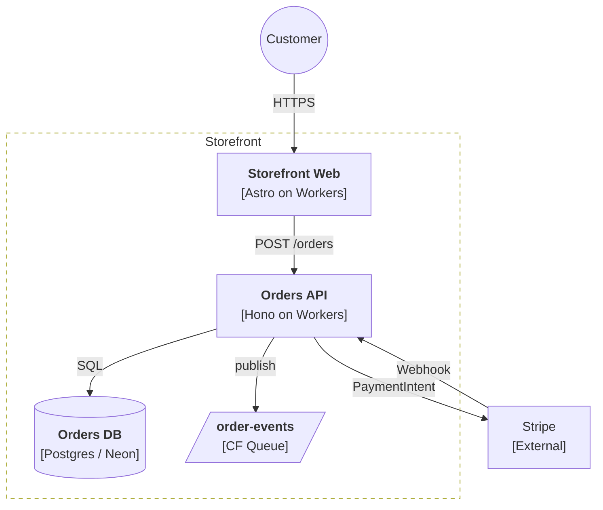
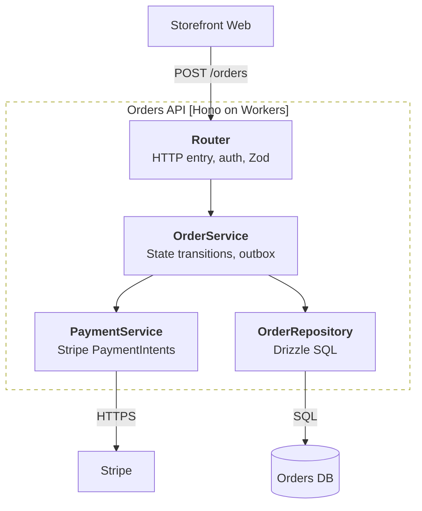

# Mermaid C4 Templates
Uses `flowchart` (not `C4Context`) for universal rendering (GitHub, Obsidian, VS Code, Notion).

## Styling
Paste at the bottom of any diagram:

```text
classDef person fill:#08427b,stroke:#052e56,color:#fff
classDef container fill:#1168bd,stroke:#0b4884,color:#fff
classDef db fill:#1168bd,stroke:#0b4884,color:#fff
classDef external fill:#999,stroke:#666,color:#fff
classDef queue fill:#438dd5,stroke:#2a6496,color:#fff
```

Shapes: Person `(( ))`, Data store `[( )]`, Queue `[/ /]`, System boundary `subgraph` with dashed border.

## Level 1 -- System Context


## Level 2 -- Container


## Level 3 -- Component


## Tips
- Labels: 3 lines max per node. Protocol on the arrow, not the node.
- Max ~15 elements per diagram. More = split or zoom out.
- Reorder nodes to reduce arrow crossings. Try `TB` (default) or `LR` for wide systems.
