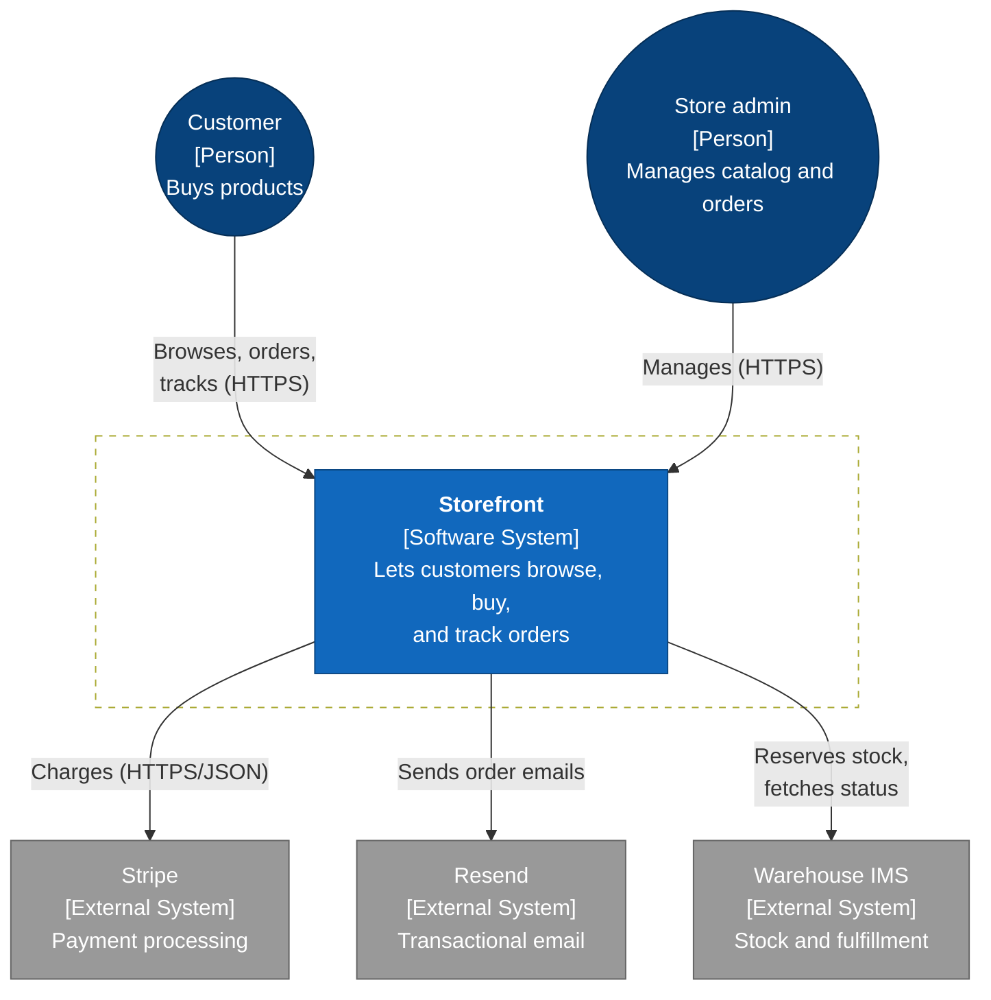
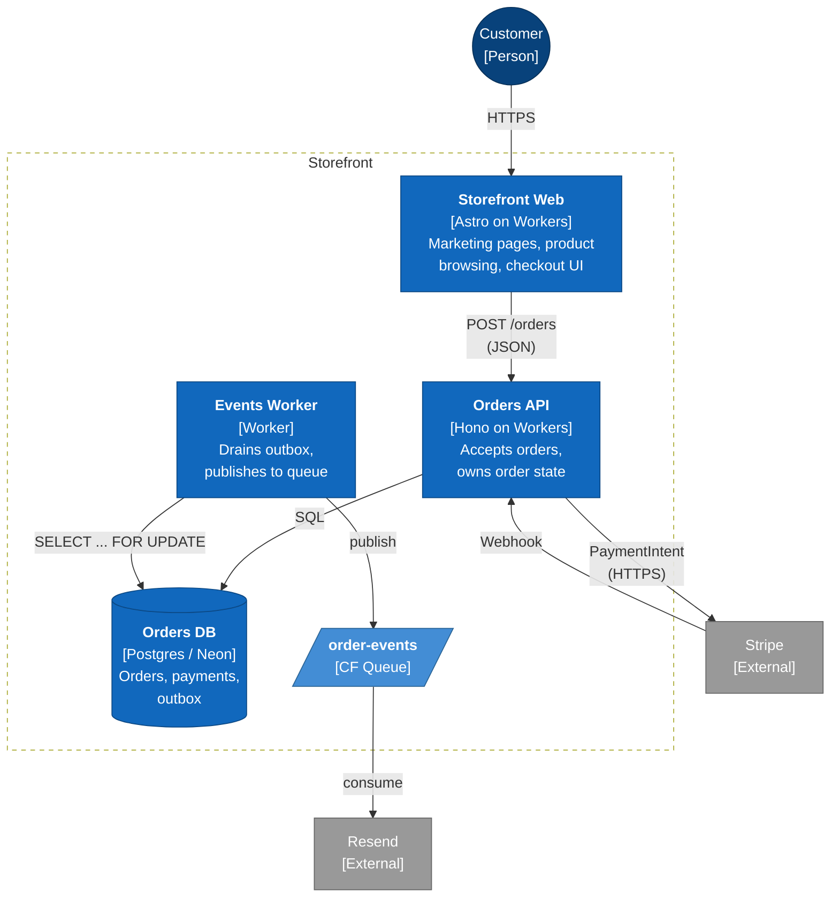
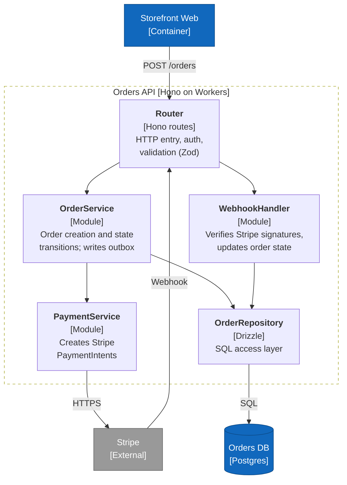

# Mermaid Templates for C4 Levels

Mermaid's C4 support (`C4Context`) is inconsistently rendered. These templates use `flowchart` instead, which renders everywhere (GitHub, Obsidian, Notion, VS Code preview, etc.) and stays readable.

## Styling conventions

Consistent colors/shapes across all three levels make it easy to jump between them:

- **Person** → stadium shape `(( ))` or rounded, outlined blue
- **System in focus (boundary)** → subgraph with a dashed border
- **Container** inside the boundary → rectangle, filled light blue
- **External system** → rectangle, filled grey
- **Data store** → cylinder `[( )]`
- **Queue / topic** → parallelogram `[/ /]` or a distinct color

Paste this classDef block at the bottom of any diagram to apply the styling:

```
classDef person fill:#08427b,stroke:#052e56,color:#fff
classDef container fill:#1168bd,stroke:#0b4884,color:#fff
classDef db fill:#1168bd,stroke:#0b4884,color:#fff
classDef external fill:#999,stroke:#666,color:#fff
classDef queue fill:#438dd5,stroke:#2a6496,color:#fff
```

---

## Level 1 — System Context

Shows the system as a black box, its users, and the external systems it talks to.



---

## Level 2 — Container

Shows the runnable pieces inside the system, their tech, and how they communicate.



---

## Level 3 — Component

Shows modules inside one container. In this example, we zoom into the Orders API.



---

## Tips

- **Keep labels short inside nodes.** Use `<br/>` for newlines; three lines max per node is comfortable.
- **Put protocol on the arrow**, not the node. `-->|"HTTPS/JSON"|` is clearer than sticking it in the box.
- **Reorder to reduce crossings.** `flowchart TB` (top-to-bottom) usually works; try `LR` for wide systems.
- **A legend is redundant but helpful.** After the diagram, list each element with its responsibility for copy-paste into tickets.
