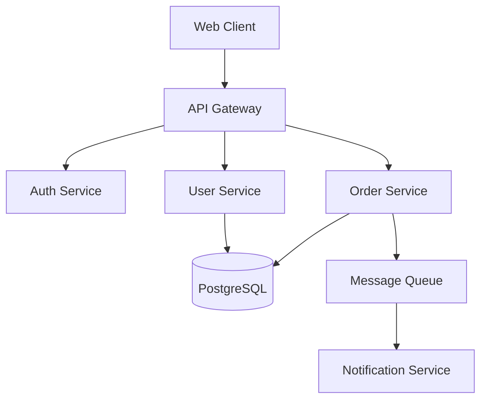
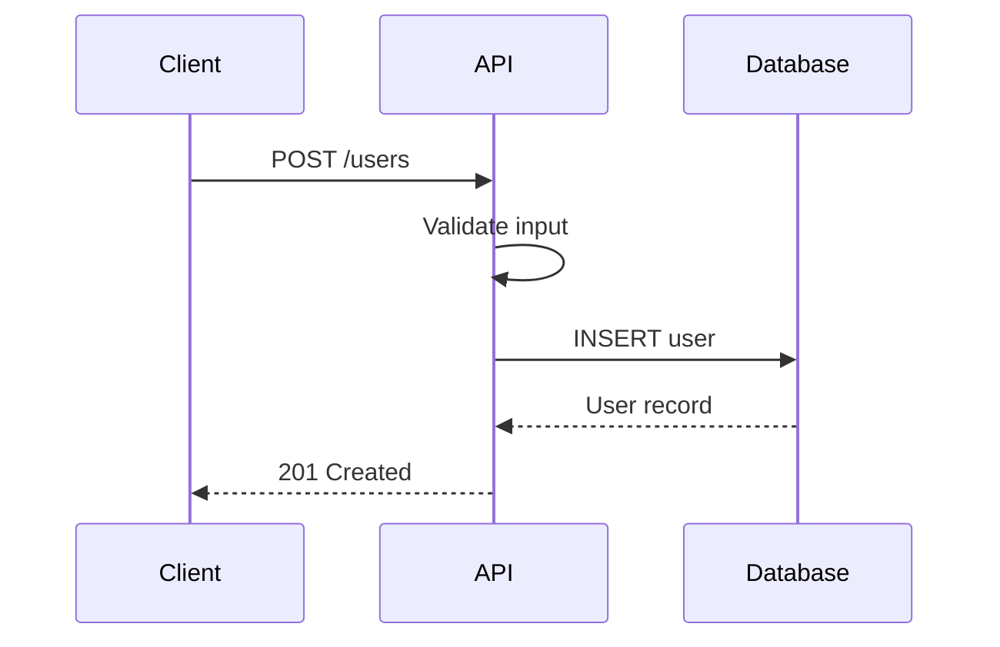
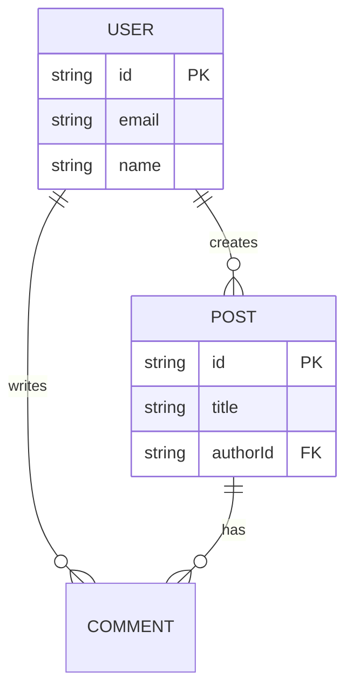

# Architecture Diagrams

Creates architecture documentation using text-based diagrams.

## Your Task

1. **Understand system**: Analyze the codebase structure
2. **Identify components**: List major parts
3. **Map relationships**: Document interactions
4. **Create diagrams**: Use Mermaid or similar
5. **Document decisions**: Add ADRs if needed

## Mermaid Diagrams

### System Architecture



### Sequence Diagram



### Entity Relationship



## Architecture Decision Records

```markdown
# ADR-001: Use PostgreSQL for primary database

## Status
Accepted

## Context
We need a reliable database for storing user and transaction data.

## Decision
Use PostgreSQL as our primary database.

## Consequences
- **Positive**: ACID compliance, rich query capabilities
- **Negative**: Requires more operational expertise
```

## Documentation Structure

```
docs/
├── architecture/
│   ├── overview.md
│   ├── diagrams/
│   │   ├── system.md
│   │   └── data-flow.md
│   └── decisions/
│       ├── ADR-001-database.md
│       └── ADR-002-auth.md
└── api/
```

## Tips

- Use text-based diagrams (version control friendly)
- Keep diagrams up to date
- Document the "why" not just "what"
- Link diagrams from code comments
